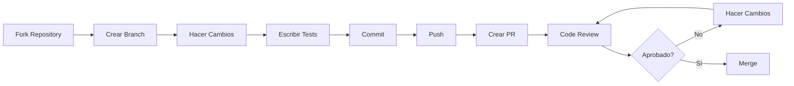

# 🤝 Guía de Contribución - Accessibility Gateway

¡Gracias por tu interés en contribuir al proyecto Accessibility Gateway! Esta guía te ayudará a entender cómo puedes participar.

---

## 📋 Tabla de Contenidos

- [Código de Conducta](#código-de-conducta)
- [Cómo Contribuir](#cómo-contribuir)
- [Reportar Bugs](#reportar-bugs)
- [Solicitar Features](#solicitar-features)
- [Pull Requests](#pull-requests)
- [Estándares de Código](#estándares-de-código)
- [Proceso de Revisión](#proceso-de-revisión)
- [Guías de Estilo](#guías-de-estilo)
- [Comunidad](#comunidad)

---

## Código de Conducta

Este proyecto se adhiere al siguiente código de conducta:

### Nuestros Compromisos

- **Respeto**: Tratar a todos con respeto y cortesía
- **Inclusión**: Crear un ambiente acogedor para todos
- **Colaboración**: Trabajar juntos de manera constructiva
- **Profesionalismo**: Mantener comunicación profesional
- **Transparencia**: Ser abiertos sobre decisiones y procesos

### Comportamiento Esperado

✅ **Hacer:**

- Usar lenguaje inclusivo y respetuoso
- Aceptar críticas constructivas
- Enfocarse en lo mejor para el proyecto
- Mostrar empatía hacia otros miembros
- Respetar diferentes puntos de vista

❌ **No Hacer:**

- Usar lenguaje sexualizado o inapropiado
- Hacer ataques personales o políticos
- Acosar pública o privadamente
- Publicar información privada de otros
- Conducta poco profesional

### Reportar Violaciones

Si observas comportamiento inaceptable, contacta a:

- **Email**: fgiocl@outlook.com
- **GitHub Issues**: [Reportar Problema](../../issues)

---

## Cómo Contribuir

Hay muchas formas de contribuir al proyecto:

### 1. 🐛 Reportar Bugs

¿Encontraste un bug? ¡Ayúdanos a arreglarlo!

- Busca primero si ya existe un issue similar
- Crea un nuevo issue con detalles completos
- Incluye pasos para reproducir el problema
- Adjunta logs, screenshots si aplica

[Reportar Bug →](../../issues/new?template=bug_report.md)

### 2. 💡 Sugerir Features

¿Tienes una idea para mejorar el proyecto?

- Describe claramente la funcionalidad deseada
- Explica por qué sería útil
- Proporciona ejemplos de uso
- Considera alternativas

[Solicitar Feature →](../../issues/new?template=feature_request.md)

### 3. 📖 Mejorar Documentación

La documentación siempre puede mejorar:

- Corregir errores tipográficos
- Agregar ejemplos faltantes
- Clarificar explicaciones confusas
- Traducir documentación

### 4. 💻 Contribuir Código

Implementa features, arregla bugs, mejora performance:

- Sigue las guías de estilo
- Escribe tests para tu código
- Actualiza documentación
- Crea un Pull Request

### 5. 🧪 Testing

Ayuda a mejorar la calidad:

- Ejecuta tests y reporta fallos
- Escribe nuevos tests
- Mejora cobertura de tests
- Realiza pruebas de performance

### 6. 🎨 Diseño y UX

Mejora la experiencia de usuario:

- Diseña mejores interfaces
- Optimiza workflows
- Mejora accesibilidad
- Proporciona feedback de UX

---

## Reportar Bugs

### Antes de Reportar

1. **Busca issues existentes**: Revisa si ya fue reportado
2. **Verifica versión**: Asegúrate de usar la última versión
3. **Reproduce el bug**: Confirma que puedes reproducirlo consistentemente
4. **Recopila información**: Logs, environment, pasos reproducibles

### Template de Bug Report

```markdown
## Descripción del Bug

[Descripción clara y concisa del bug]

## Pasos para Reproducir

1. Ir a '...'
2. Hacer click en '...'
3. Ejecutar comando '...'
4. Ver error

## Comportamiento Esperado

[Qué esperabas que sucediera]

## Comportamiento Actual

[Qué sucedió realmente]

## Screenshots

[Si aplica, agregar screenshots]

## Entorno

- OS: [e.g., Windows 11]
- .NET Version: [e.g., 9.0.100]
- Docker Version: [e.g., 27.4.0]
- Versión del Gateway: [e.g., 2.0.0]

## Logs
```

[Pegar logs relevantes aquí]

```

## Información Adicional
[Cualquier otro contexto relevante]
```

### Severidad de Bugs

| Nivel       | Descripción                       | Tiempo Respuesta |
| ----------- | --------------------------------- | ---------------- |
| **Crítico** | Sistema no funciona, data loss    | 24 horas         |
| **Alto**    | Funcionalidad principal rota      | 48 horas         |
| **Medio**   | Funcionalidad secundaria afectada | 1 semana         |
| **Bajo**    | Problema cosmético o menor        | 2 semanas        |

---

## Solicitar Features

### Antes de Solicitar

1. **Busca features similares**: Puede que ya exista o esté en desarrollo
2. **Considera el scope**: ¿Encaja con la visión del proyecto?
3. **Evalúa alternativas**: ¿Hay otras formas de lograr lo mismo?
4. **Prepara casos de uso**: Ejemplos concretos de uso

### Template de Feature Request

```markdown
## Feature Deseado

[Descripción clara y concisa del feature]

## Problema que Resuelve

[¿Qué problema actual resuelve este feature?]

## Solución Propuesta

[Cómo debería funcionar el feature]

## Alternativas Consideradas

[Otras formas de resolver el problema]

## Casos de Uso

1. Como [rol], quiero [acción] para [beneficio]
2. Como [rol], necesito [acción] para [beneficio]

## Mockups/Ejemplos

[Si aplica, agregar mockups o ejemplos de código]

## Impacto

- **Usuarios afectados**: [e.g., Todos, Admins, Developers]
- **Prioridad**: [Alta/Media/Baja]
- **Breaking changes**: [Sí/No]

## Información Adicional

[Cualquier contexto adicional]
```

### Priorización de Features

| Prioridad | Criterios                                     |
| --------- | --------------------------------------------- |
| **P0**    | Crítico, bloqueante, afecta a todos los users |
| **P1**    | Alta, feature importante, muchos users        |
| **P2**    | Media, mejora significativa                   |
| **P3**    | Baja, nice-to-have, pocos users               |

---

## Pull Requests

### Proceso General



### Paso a Paso

#### 1. Fork y Clone

```bash
# Fork en GitHub UI
# Luego clone tu fork
git clone https://github.com/TU-USERNAME/accessibility-gw.git
cd accessibility-gw

# Agregar remote upstream
git remote add upstream https://github.com/magodeveloper/accessibility-gw.git
```

#### 2. Crear Branch

```bash
# Actualizar master
git checkout master
git pull upstream master

# Crear branch de feature
git checkout -b feature/nombre-descriptivo

# Convenciones de nombres:
# feature/  - Nueva funcionalidad
# fix/      - Corrección de bug
# docs/     - Cambios en documentación
# refactor/ - Refactoring
# test/     - Tests
# chore/    - Mantenimiento
```

#### 3. Hacer Cambios

```bash
# Desarrolla tu feature
# Sigue las guías de estilo
# Escribe código limpio y documentado
```

#### 4. Escribir Tests

```bash
# Tests unitarios
dotnet test --filter "FullyQualifiedName~TuFeature"

# Verificar cobertura
.\manage-tests.ps1 coverage

# Cobertura debe ser >90%
```

#### 5. Formatear Código

```bash
# Auto-formatear
dotnet format

# Verificar warnings
dotnet build /p:TreatWarningsAsErrors=true
```

#### 6. Commit

```bash
# Stage cambios
git add .

# Commit con mensaje descriptivo
git commit -m "feat: agregar cache distribuido para análisis"

# Formato Conventional Commits:
# feat: Nueva funcionalidad
# fix: Corrección de bug
# docs: Cambios en documentación
# style: Formateo, no cambia lógica
# refactor: Refactoring
# test: Agregar tests
# chore: Mantenimiento
# perf: Mejoras de performance
# ci: Cambios en CI/CD
```

#### 7. Push

```bash
# Push a tu fork
git push origin feature/nombre-descriptivo
```

#### 8. Crear Pull Request

1. Ve a tu fork en GitHub
2. Click en "Compare & pull request"
3. Llena el template de PR
4. Asigna reviewers
5. Agrega labels apropiados

### Template de Pull Request

```markdown
## Descripción

[Descripción clara de los cambios realizados]

## Tipo de Cambio

- [ ] Bug fix (cambio que corrige un issue)
- [ ] New feature (cambio que agrega funcionalidad)
- [ ] Breaking change (fix o feature que causa que funcionalidad existente no funcione como antes)
- [ ] Documentación

## Issue Relacionado

Fixes #[issue number]

## Cambios Realizados

- [Cambio 1]
- [Cambio 2]
- [Cambio 3]

## Testing Realizado

- [ ] Unit tests
- [ ] Integration tests
- [ ] Manual testing
- [ ] Load testing (si aplica)

## Screenshots

[Si aplica, agregar screenshots]

## Checklist

- [ ] Mi código sigue las guías de estilo
- [ ] He realizado self-review de mi código
- [ ] He comentado código complejo
- [ ] He actualizado documentación
- [ ] Mis cambios no generan nuevos warnings
- [ ] He agregado tests que prueban mi fix/feature
- [ ] Tests nuevos y existentes pasan localmente
- [ ] Coverage es >90%
- [ ] He actualizado el CHANGELOG.md

## Notas Adicionales

[Cualquier información adicional para reviewers]
```

### Guías de PR

✅ **Hacer:**

- Mantener PRs pequeños y enfocados (< 500 líneas)
- Escribir descripción clara y detallada
- Agregar tests para todos los cambios
- Actualizar documentación relevante
- Responder a comentarios de reviewers
- Hacer commits atómicos y descriptivos
- Rebase si es necesario antes de merge

❌ **No Hacer:**

- PRs masivos con múltiples features
- Mezclar refactoring con features
- Ignorar comentarios de reviewers
- Hacer force push después de review
- Agregar cambios no relacionados
- Dejar tests fallando
- Disminuir cobertura de tests

---

## Estándares de Código

### C# Style Guide

Ver [DEVELOPMENT.md](DEVELOPMENT.md#convenciones-de-código) para guía completa.

#### Highlights

```csharp
// ✅ Naming
public class UserService { }
public async Task<User> GetUserAsync(int userId) { }
private readonly ILogger _logger;

// ✅ File-scoped namespaces
namespace Gateway.Services;

// ✅ Async suffix
public async Task<Result> ProcessAsync()

// ✅ Constructor injection
public UserService(IUserRepository repository)
{
    _repository = repository;
}

// ✅ Structured logging
_logger.LogInformation("User {UserId} created", userId);

// ✅ Try-catch específico
catch (NotFoundException ex)
{
    _logger.LogWarning(ex, "User not found");
    return NotFound();
}
```

### Testing Standards

```csharp
// ✅ Naming: MethodName_Scenario_ExpectedResult
[Fact]
public async Task GetUser_WithValidId_ReturnsUser()
{
    // Arrange
    var userId = 1;
    _mockRepo.FindAsync(userId).Returns(expectedUser);

    // Act
    var result = await _service.GetUserAsync(userId);

    // Assert
    result.Should().NotBeNull();
    result.Id.Should().Be(userId);
}

// ✅ Use FluentAssertions
result.Should().Be(expected);
users.Should().HaveCount(5);
action.Should().ThrowAsync<ArgumentException>();

// ✅ Theory para múltiples casos
[Theory]
[InlineData(0)]
[InlineData(-1)]
public async Task GetUser_WithInvalidId_ThrowsException(int id)
```

### Documentation Standards

```csharp
/// <summary>
/// Obtiene un usuario por su ID.
/// </summary>
/// <param name="userId">ID del usuario a buscar</param>
/// <returns>Usuario encontrado</returns>
/// <exception cref="NotFoundException">Si el usuario no existe</exception>
public async Task<User> GetUserAsync(int userId)
{
    // Implementation
}
```

---

## Proceso de Revisión

### Para el Autor del PR

1. **Self-review**: Revisa tu propio código antes de solicitar review
2. **Tests**: Asegúrate que todos los tests pasen
3. **Documentation**: Actualiza docs si es necesario
4. **Responsive**: Responde a comentarios en <24 horas
5. **Changes**: Haz cambios solicitados y notifica

### Para Reviewers

1. **Timely**: Revisa PRs en <48 horas
2. **Constructive**: Proporciona feedback constructivo
3. **Specific**: Se específico en comentarios
4. **Questions**: Haz preguntas si algo no está claro
5. **Approve**: Aprueba cuando todo esté bien

### Criterios de Aprobación

✅ **Aprobar si:**

- Código sigue guías de estilo
- Tests cubren cambios (>90% coverage)
- Documentación actualizada
- No hay warnings/errors
- Lógica es correcta y eficiente
- No hay security issues

❌ **No aprobar si:**

- Tests fallan
- Coverage disminuye <90%
- Hay warnings o errors
- Documentación falta
- Security issues presentes
- Performance degradada significativamente

### Tipos de Comentarios

```markdown
# Blocking (debe ser resuelto)

🚫 **Must fix**: Esto debe ser corregido antes de merge

# Non-blocking (sugerencia)

💡 **Suggestion**: Considera usar X en lugar de Y

# Question (requiere clarificación)

❓ **Question**: ¿Por qué se usa este approach?

# Nit (cosmético, no crítico)

✨ **Nit**: Typo en comentario línea 45

# Praise (buen trabajo)

👍 **Nice**: Excelente solución al problema!
```

---

## Guías de Estilo

### Git Commit Messages

```bash
# Formato
<type>(<scope>): <subject>

<body>

<footer>

# Ejemplos
feat(auth): agregar autenticación JWT

Implementa sistema completo de autenticación usando JWT.
- Agregar JwtService
- Agregar middleware de autenticación
- Actualizar tests

Closes #123

fix(cache): corregir memory leak en Redis client

El cliente Redis no se estaba disposing correctamente,
causando memory leak después de varias horas.

Breaking change: Cambió signature de CacheService constructor
```

### Types de Commits

| Type       | Descripción                          |
| ---------- | ------------------------------------ |
| `feat`     | Nueva funcionalidad                  |
| `fix`      | Corrección de bug                    |
| `docs`     | Cambios en documentación             |
| `style`    | Formateo, no afecta lógica           |
| `refactor` | Refactoring, no cambia funcionalidad |
| `perf`     | Mejoras de performance               |
| `test`     | Agregar o modificar tests            |
| `chore`    | Mantenimiento, actualizar deps       |
| `ci`       | Cambios en CI/CD                     |
| `build`    | Cambios en build system              |
| `revert`   | Revertir commit previo               |

### Branch Naming

```bash
# Formato
<type>/<description-in-kebab-case>

# Ejemplos
feature/add-jwt-authentication
fix/redis-connection-timeout
docs/update-api-reference
refactor/simplify-cache-service
test/add-integration-tests
chore/update-dependencies
```

---

## Comunidad

### Comunicación

- **GitHub Issues**: Para bugs y features
- **GitHub Discussions**: Para preguntas y discusiones
- **Pull Requests**: Para contribuir código
- **Email**: fgiocl@outlook.com para temas privados

### Recursos

- **README**: [README.md](../README.md)
- **Documentación**: [docs/](.)
- **Development Guide**: [DEVELOPMENT.md](DEVELOPMENT.md)
- **Changelog**: [CHANGELOG.md](../CHANGELOG.md)

### Reconocimiento

Los contribuidores serán reconocidos en:

- README.md (Contributors section)
- CHANGELOG.md (por cada release)
- GitHub Contributors page

---

## Preguntas Frecuentes

### ¿Puedo trabajar en un issue que ya está asignado?

No, si un issue está asignado, alguien más está trabajando en él. Puedes:

- Ofrecer ayuda al assignee
- Trabajar en otro issue
- Crear un nuevo issue si es diferente

### ¿Cuánto tiempo toma una review?

Normalmente:

- Issues simples: 24-48 horas
- Features medianas: 3-5 días
- Features grandes: 1 semana

### ¿Qué hago si mi PR no es aprobado?

1. Lee cuidadosamente los comentarios
2. Haz las correcciones necesarias
3. Responde a todos los comentarios
4. Solicita re-review
5. Si no estás de acuerdo, explica tu razonamiento

### ¿Puedo contribuir si soy principiante?

¡Por supuesto! Busca issues etiquetados como:

- `good first issue` - Buenos para principiantes
- `help wanted` - Se necesita ayuda
- `documentation` - Mejoras de docs

---

## Licencia

Al contribuir, aceptas que tus contribuciones serán licenciadas bajo la misma licencia del proyecto (Proprietary License).

---

**¡Gracias por contribuir al Accessibility Gateway!** 🎉

Tu tiempo y esfuerzo son muy apreciados y ayudan a hacer este proyecto mejor para todos.

---

**Preguntas?** Contacta a: fgiocl@outlook.com

**Última actualización:** 6 de noviembre de 2025
