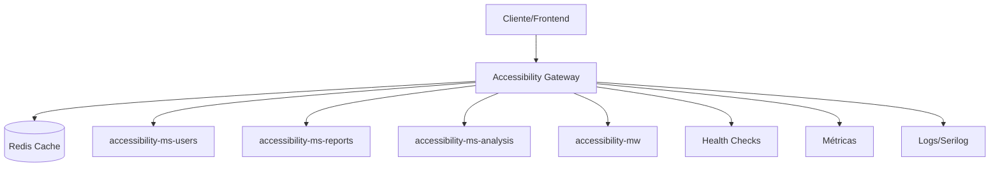

# 🚪 Accessibility Gateway

Un gateway HTTP completo y robusto desarrollado en .NET 9 para traducir y enrutar peticiones RESTful hacia los microservicios de la plataforma de accesibilidad.

## 🏗️ Arquitectura



## ✨ Características Principales

### 🔧 Funcionalidades Core

- **Traducción de Peticiones**: Convierte peticiones REST a llamadas específicas de microservicios
- **Enrutamiento Inteligente**: Distribuye el tráfico basado en configuración de servicios
- **Load Balancing**: Distribución equilibrada de carga (preparado para múltiples instancias)
- **Circuit Breaker**: Protección contra fallos en cascada
- **Retry Policy**: Reintentos automáticos con backoff exponencial

### 🛡️ Seguridad y Resiliencia

- **Autenticación JWT**: Soporte completo para Bearer tokens
- **Rate Limiting**: Límites configurables por cliente/endpoint
- **CORS**: Configuración flexible de políticas de origen cruzado
- **Validation**: Validación exhaustiva de entrada
- **Security Headers**: Headers de seguridad automáticos

### 📊 Observabilidad

- **Health Checks**: Verificación de salud de servicios y dependencias
- **Métricas Detalladas**: Estadísticas de rendimiento y uso
- **Logging Estructurado**: Logs con Serilog y correlación de requests
- **Tracing Distribuido**: Trazabilidad end-to-end de peticiones
- **Swagger/OpenAPI**: Documentación interactiva completa

### ⚡ Performance

- **Caché Distribuido**: Redis para caché de respuestas GET
- **Output Caching**: Caché de respuesta HTTP nativo de ASP.NET Core
- **Connection Pooling**: Reutilización eficiente de conexiones HTTP
- **Compression**: Compresión automática de respuestas

## 🚀 Inicio Rápido

### Prerrequisitos

- .NET 9.0 SDK
- Docker & Docker Compose
- Redis (opcional, incluido en docker-compose)

### 1. Clonar y Configurar

```bash
git clone <repository-url>
cd accessibility-gw
```

### 2. Configuración Local

Copiar y editar el archivo de configuración:

```bash
cp src/appsettings.json src/appsettings.Development.json
```

Ajustar las URLs de los servicios:

```json
{
  "Gate": {
    "Services": {
      "users": "https://localhost:8080",
      "reports": "https://localhost:8081",
      "analysis": "https://localhost:8082",
      "middleware": "https://localhost:3000"
    }
  }
}
```

### 3. Ejecutar con Docker (Recomendado)

```bash
# Desarrollo
docker-compose -f docker-compose.dev.yml up -d

# Producción
docker-compose up -d
```

### 4. Ejecutar en Local

```bash
cd src
dotnet restore
dotnet run
```

El gateway estará disponible en:

- **API**: http://localhost:8080
- **Swagger**: http://localhost:8080/swagger
- **Health Checks**: http://localhost:8080/health
- **Métricas**: http://localhost:8080/metrics

## 📖 Uso de la API

### Endpoint Principal de Traducción

**POST** `/api/v1/translate`

```json
{
  "service": "users",
  "method": "GET",
  "path": "/api/users/123",
  "query": {
    "expand": "preferences"
  },
  "headers": {
    "X-Custom-Header": "value"
  },
  "body": null,
  "useCache": true,
  "cacheExpirationMinutes": 5
}
```

### Endpoints Directos por Servicio

**GET/POST/PUT/PATCH/DELETE** `/api/v1/services/{service}/{path}`

Ejemplos:

```bash
# Obtener usuario
GET /api/v1/services/users/api/users/123

# Crear reporte
POST /api/v1/services/reports/api/reports
Content-Type: application/json
{
  "title": "Accessibility Report",
  "content": "..."
}

# Ejecutar análisis
POST /api/v1/services/analysis/api/analysis/scan
{
  "url": "https://example.com",
  "type": "wcag"
}
```

### Servicios Disponibles

| Servicio     | Descripción                         | Rutas Permitidas              |
| ------------ | ----------------------------------- | ----------------------------- |
| `users`      | Gestión de usuarios y autenticación | `/api/users/*`, `/api/auth/*` |
| `reports`    | Generación y gestión de reportes    | `/api/reports/*`              |
| `analysis`   | Análisis de accesibilidad           | `/api/analysis/*`             |
| `middleware` | API de middleware de accesibilidad  | `/api/accessibility/*`        |

## 🔧 Configuración

### Variables de Entorno Principales

```bash
# Configuración de servicios
Gate__Services__users=http://users-service:8080
Gate__Services__reports=http://reports-service:8081
Gate__Services__analysis=http://analysis-service:8082
Gate__Services__middleware=http://middleware-service:3000

# Autenticación JWT
Jwt__Authority=https://your-identity-server
Jwt__Audience=accessibility-gateway

# Redis Cache
Redis__ConnectionString=localhost:6379

# Configuraciones adicionales
Gate__DefaultTimeoutSeconds=30
Gate__MaxPayloadSizeBytes=10485760
Gate__EnableCaching=true
```

### Configuración de Servicios Permitidos

```json
{
  "Gate": {
    "AllowedRoutes": [
      {
        "service": "users",
        "methods": ["GET", "POST", "PUT", "DELETE"],
        "pathPrefix": "/api/users",
        "requiresAuth": true,
        "requiredRoles": ["User"]
      }
    ]
  }
}
```

## � Documentación API

El gateway incluye documentación completa de todos los endpoints disponibles:

### 🌐 Swagger UI Interactivo

- **URL**: `http://localhost:8000/swagger`
- **Características**: Interfaz interactiva, testing de endpoints, esquemas detallados
- **Autenticación**: Soporte para JWT tokens en la interfaz

### 📋 Documentación Completa

- **Ubicación**: `docs/swagger/index.html`
- **Contenido**: Vista general de servicios, guías de inicio rápido, ejemplos
- **Servicios**: Gateway + 4 microservicios + middleware API

### 📄 Especificación OpenAPI

- **Archivo**: `docs/swagger/gateway-complete-api.yaml`
- **Estándar**: OpenAPI 3.0.3
- **Endpoints**: 50+ endpoints documentados
- **Esquemas**: 25+ modelos de datos definidos

### 🔧 Endpoints Principales

| Servicio       | Endpoints Clave           | Descripción              |
| -------------- | ------------------------- | ------------------------ |
| **Gateway**    | `POST /api/v1/translate`  | Traducción de peticiones |
| **Users**      | `POST /api/v1/auth/login` | Autenticación JWT        |
| **Reports**    | `GET/POST /api/report`    | Gestión de reportes      |
| **Analysis**   | `GET/POST /api/analysis`  | Motor de análisis        |
| **Tools**      | `POST /api/analyze/url`   | Análisis con axe-core    |
| **Monitoring** | `GET /health`, `/metrics` | Health checks y métricas |

### 🧪 Testing de APIs

```bash
# 1. Obtener token JWT
curl -X POST "http://localhost:8000/api/v1/auth/login" \
  -H "Content-Type: application/json" \
  -d '{"email": "user@example.com", "password": "password123"}'

# 2. Usar el token en peticiones
curl -X GET "http://localhost:8000/api/v1/users" \
  -H "Authorization: Bearer YOUR_JWT_TOKEN"

# 3. Analizar sitio web
curl -X POST "http://localhost:8000/api/analyze/url" \
  -H "Authorization: Bearer YOUR_JWT_TOKEN" \
  -H "Content-Type: application/json" \
  -d '{"url": "https://example.com", "wcagLevel": "AA"}'
```

## �📊 Monitoreo y Observabilidad

### Health Checks

```bash
# Verificación básica
GET /health

# Verificación profunda con métricas
GET /health?deep=true&includeMetrics=true

# Liveness probe (para Kubernetes)
GET /health/live

# Readiness probe (para Kubernetes)
GET /health/ready
```

### Métricas

```bash
# Obtener métricas actuales
GET /metrics

# Reiniciar métricas
POST /metrics/reset
```

### Gestión de Caché

```bash
# Invalidar caché de un servicio
DELETE /cache/{service}

# Ejemplo: invalidar caché del servicio users
DELETE /cache/users
```

## 🐳 Docker y Despliegue

### Build de Imagen Docker

```bash
# Desarrollo
./docker-build.ps1 dev

# Producción
./docker-build.ps1 prod

# Con push a registry
./docker-build.ps1 prod -Push -Registry "myregistry.com" -Version "1.0.0"
```

### Limpieza Docker

```bash
# Limpiar contenedores e imágenes
./docker-cleanup.ps1

# Limpiar incluyendo volúmenes y redes
./docker-cleanup.ps1 -Volumes -Networks -Force
```

### Docker Compose

```bash
# Desarrollo con hot reload
docker-compose -f docker-compose.dev.yml up -d

# Producción
docker-compose up -d

# Ver logs
docker-compose logs -f accessibility-gateway

# Escalar el gateway
docker-compose up -d --scale accessibility-gateway=3
```

## 🧪 Testing

### Pruebas con curl

```bash
# Health check
curl http://localhost:8080/health

# Traducción básica
curl -X POST http://localhost:8080/api/v1/translate \
  -H "Content-Type: application/json" \
  -d '{
    "service": "users",
    "method": "GET",
    "path": "/api/users"
  }'

# Llamada directa
curl http://localhost:8080/api/v1/services/users/api/users/123
```

### Pruebas con herramientas

- **Swagger UI**: http://localhost:8080/swagger
- **Health Checks UI**: http://localhost:8080/healthchecks-ui
- **Postman Collection**: Importar desde `/docs/postman/`

## 🔒 Seguridad

### Autenticación JWT

```bash
# Llamada autenticada
curl -X POST http://localhost:8080/api/v1/translate \
  -H "Authorization: Bearer <jwt-token>" \
  -H "Content-Type: application/json" \
  -d '{...}'
```

### Rate Limiting

- **Global**: 50 RPS por cliente
- **Public**: 100 RPS para endpoints públicos
- **Burst**: Hasta 200 peticiones de ráfaga

### Headers de Seguridad

El gateway automáticamente añade headers de seguridad:

- `X-Frame-Options`
- `X-Content-Type-Options`
- `X-XSS-Protection`
- `Referrer-Policy`
- `Content-Security-Policy`

## 📈 Performance y Escalabilidad

### Métricas de Rendimiento

- **Latencia promedio**: < 50ms para peticiones cacheadas
- **Throughput**: > 10,000 RPS en configuración optimizada
- **Memory footprint**: ~100MB en estado idle

### Optimizaciones

- Caché Redis distribuido
- Connection pooling HTTP
- Compresión gzip automática
- Circuit breakers por servicio
- Retry policies con backoff exponencial

### Escalabilidad Horizontal

```yaml
# docker-compose.yml
services:
  accessibility-gateway:
    deploy:
      replicas: 3
    # ... resto de configuración
```

## 🚨 Troubleshooting

### Problemas Comunes

1. **Gateway no encuentra servicios**

   ```bash
   # Verificar conectividad
   docker exec accessibility-gw curl -f http://users-service:8080/health
   ```

2. **Rate limiting activo**

   ```bash
   # Verificar headers de respuesta
   curl -I http://localhost:8080/api/v1/translate
   ```

3. **Caché no funciona**
   ```bash
   # Verificar Redis
   docker exec accessibility-redis redis-cli ping
   ```

### Logs Útiles

```bash
# Ver logs del gateway
docker-compose logs -f accessibility-gateway

# Ver logs con filtro
docker-compose logs accessibility-gateway | grep ERROR

# Logs estructurados en archivo
tail -f ./logs/gateway-$(date +%Y%m%d).log
```

## 🤝 Contribución

### Desarrollo Local

1. Fork del repositorio
2. Crear rama de feature: `git checkout -b feature/nueva-funcionalidad`
3. Desarrollo y pruebas
4. Commit: `git commit -m 'Add: nueva funcionalidad'`
5. Push: `git push origin feature/nueva-funcionalidad`
6. Crear Pull Request

### Standards de Código

- Seguir convenciones de C# y .NET
- Documentar APIs con comentarios XML
- Pruebas unitarias para nueva funcionalidad
- Logs estructurados con contexto relevante

## 📄 Licencia

Este proyecto está licenciado bajo la Licencia MIT - ver el archivo [LICENSE](LICENSE) para detalles.

## 🆘 Soporte

- **Documentación**: [Wiki del proyecto](../../wiki)
- **Issues**: [GitHub Issues](../../issues)
- **Discusiones**: [GitHub Discussions](../../discussions)

---

**Desarrollado con ❤️ por el equipo de Accessibility Platform**
