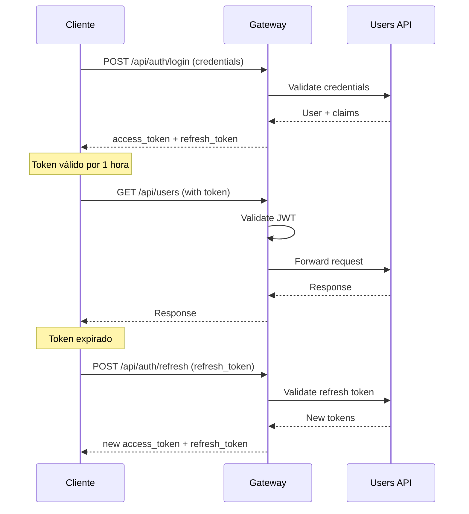

# 📡 Documentación de API

> Referencia completa de endpoints, rutas proxy y ejemplos de uso del Gateway.

## 📋 Tabla de Contenidos

- [Endpoints del Gateway](#endpoints-del-gateway)
- [Rutas Proxy](#rutas-proxy)
- [Autenticación](#autenticación)
- [Ejemplos de Uso](#ejemplos-de-uso)
- [Códigos de Error](#códigos-de-error)
- [Rate Limiting](#rate-limiting)

---

## 🚪 Endpoints del Gateway

### Health & Monitoring

#### GET /health/live

Liveness probe - verifica que el gateway esté ejecutándose.

```bash
curl http://localhost:8100/health/live
```

**Response 200 OK:**

```json
{
  "status": "Healthy"
}
```

#### GET /health/ready

Readiness probe - verifica que todos los servicios estén disponibles.

```bash
curl http://localhost:8100/health/ready
```

**Response 200 OK:**

```json
{
  "status": "Healthy",
  "totalDuration": "00:00:00.0562741",
  "entries": {
    "gateway": {
      "status": "Healthy",
      "duration": "00:00:00.0001234"
    },
    "redis": {
      "status": "Healthy",
      "duration": "00:00:00.0048521",
      "data": {
        "connection": "Connected",
        "database": 0
      }
    },
    "users-api": {
      "status": "Healthy",
      "duration": "00:00:00.0245123"
    },
    "analysis-api": {
      "status": "Healthy",
      "duration": "00:00:00.0156432"
    },
    "reports-api": {
      "status": "Healthy",
      "duration": "00:00:00.0089654"
    }
  }
}
```

#### GET /metrics

Métricas en formato Prometheus.

```bash
curl http://localhost:8100/metrics
```

**Response 200 OK:**

```
# HELP gateway_requests_total Total requests processed
# TYPE gateway_requests_total counter
gateway_requests_total{endpoint="/api/users",method="GET",status="200"} 1523

# HELP gateway_request_duration_seconds Request duration
# TYPE gateway_request_duration_seconds histogram
gateway_request_duration_seconds_bucket{endpoint="/api/users",le="0.1"} 1203
gateway_request_duration_seconds_bucket{endpoint="/api/users",le="0.5"} 1489

# HELP gateway_cache_hits_total Cache hits
# TYPE gateway_cache_hits_total counter
gateway_cache_hits_total{endpoint="/api/users"} 892

# HELP gateway_cache_misses_total Cache misses
# TYPE gateway_cache_misses_total counter
gateway_cache_misses_total{endpoint="/api/users"} 631
```

---

## 🔄 Rutas Proxy

El Gateway actúa como proxy reverso para los siguientes microservicios:

### Users API

#### GET /api/v1/users

Lista todos los usuarios.

**Request:**

```bash
curl -X GET http://localhost:8100/api/v1/users \
  -H "Authorization: Bearer {token}"
```

**Response 200 OK:**

```json
{
  "users": [
    {
      "id": 1,
      "email": "user@example.com",
      "name": "John Doe",
      "role": "user",
      "createdAt": "2025-01-15T10:30:00Z"
    }
  ],
  "total": 1,
  "page": 1,
  "pageSize": 20
}
```

#### GET /api/v1/users/{id}

Obtiene un usuario por ID.

**Request:**

```bash
curl -X GET http://localhost:8100/api/v1/users/123 \
  -H "Authorization: Bearer {token}"
```

**Response 200 OK:**

```json
{
  "id": 123,
  "email": "user@example.com",
  "name": "John Doe",
  "role": "user",
  "subscription": "premium",
  "createdAt": "2025-01-15T10:30:00Z",
  "lastLogin": "2025-11-06T08:15:00Z"
}
```

#### POST /api/v1/users

Crea un nuevo usuario.

**Request:**

```bash
curl -X POST http://localhost:8100/api/v1/users \
  -H "Content-Type: application/json" \
  -H "Authorization: Bearer {token}" \
  -d '{
    "email": "newuser@example.com",
    "password": "SecurePass123!",
    "name": "Jane Smith",
    "role": "user"
  }'
```

**Response 201 Created:**

```json
{
  "id": 124,
  "email": "newuser@example.com",
  "name": "Jane Smith",
  "role": "user",
  "createdAt": "2025-11-06T10:00:00Z"
}
```

#### PUT /api/v1/users/{id}

Actualiza un usuario.

**Request:**

```bash
curl -X PUT http://localhost:8100/api/v1/users/123 \
  -H "Content-Type: application/json" \
  -H "Authorization: Bearer {token}" \
  -d '{
    "name": "John Updated",
    "subscription": "enterprise"
  }'
```

**Response 200 OK:**

```json
{
  "id": 123,
  "email": "user@example.com",
  "name": "John Updated",
  "subscription": "enterprise",
  "updatedAt": "2025-11-06T10:05:00Z"
}
```

#### DELETE /api/v1/users/{id}

Elimina un usuario.

**Request:**

```bash
curl -X DELETE http://localhost:8100/api/v1/users/123 \
  -H "Authorization: Bearer {token}"
```

**Response 204 No Content**

---

### Authentication

#### POST /api/auth/login

Inicia sesión y obtiene tokens JWT.

**Request:**

```bash
curl -X POST http://localhost:8100/api/auth/login \
  -H "Content-Type: application/json" \
  -d '{
    "email": "user@example.com",
    "password": "SecurePass123!"
  }'
```

**Response 200 OK:**

```json
{
  "accessToken": "eyJhbGciOiJIUzI1NiIsInR5cCI6IkpXVCJ9...",
  "refreshToken": "def50200a1b2c3d4e5f6...",
  "tokenType": "Bearer",
  "expiresIn": 3600,
  "user": {
    "id": 123,
    "email": "user@example.com",
    "name": "John Doe",
    "role": "user"
  }
}
```

#### POST /api/auth/refresh

Renueva el token de acceso.

**Request:**

```bash
curl -X POST http://localhost:8100/api/auth/refresh \
  -H "Content-Type: application/json" \
  -d '{
    "refreshToken": "def50200a1b2c3d4e5f6..."
  }'
```

**Response 200 OK:**

```json
{
  "accessToken": "eyJhbGciOiJIUzI1NiIsInR5cCI6IkpXVCJ9...",
  "refreshToken": "def50200g7h8i9j0k1l2...",
  "tokenType": "Bearer",
  "expiresIn": 3600
}
```

#### POST /api/auth/logout

Cierra sesión e invalida tokens.

**Request:**

```bash
curl -X POST http://localhost:8100/api/auth/logout \
  -H "Authorization: Bearer {token}"
```

**Response 204 No Content**

---

### Analysis API

#### POST /api/Analysis/scan

Inicia un análisis de accesibilidad.

**Request:**

```bash
curl -X POST http://localhost:8100/api/Analysis/scan \
  -H "Content-Type: application/json" \
  -H "Authorization: Bearer {token}" \
  -d '{
    "url": "https://example.com",
    "depth": 2,
    "guidelines": ["WCAG2.1-A", "WCAG2.1-AA"],
    "includeImages": true,
    "waitForJavaScript": true
  }'
```

**Response 202 Accepted:**

```json
{
  "analysisId": "a1b2c3d4-e5f6-7890-abcd-ef1234567890",
  "status": "pending",
  "url": "https://example.com",
  "createdAt": "2025-11-06T10:00:00Z",
  "estimatedCompletionTime": "2025-11-06T10:05:00Z"
}
```

#### GET /api/Analysis/{id}

Obtiene el resultado de un análisis.

**Request:**

```bash
curl -X GET http://localhost:8100/api/Analysis/a1b2c3d4-e5f6-7890-abcd-ef1234567890 \
  -H "Authorization: Bearer {token}"
```

**Response 200 OK:**

```json
{
  "id": "a1b2c3d4-e5f6-7890-abcd-ef1234567890",
  "status": "completed",
  "url": "https://example.com",
  "startedAt": "2025-11-06T10:00:00Z",
  "completedAt": "2025-11-06T10:04:32Z",
  "summary": {
    "totalIssues": 47,
    "criticalIssues": 5,
    "majorIssues": 12,
    "minorIssues": 30,
    "score": 72.5
  },
  "issues": [
    {
      "code": "WCAG2.1-1.1.1",
      "severity": "critical",
      "message": "Image missing alt text",
      "element": "",
      "location": {
        "url": "https://example.com/home",
        "line": 45,
        "column": 12
      },
      "recommendation": "Add descriptive alt text to the image"
    }
  ]
}
```

#### GET /api/Analysis/user/{userId}

Lista análisis de un usuario.

**Request:**

```bash
curl -X GET "http://localhost:8100/api/Analysis/user/123?page=1&pageSize=20" \
  -H "Authorization: Bearer {token}"
```

**Response 200 OK:**

```json
{
  "analyses": [
    {
      "id": "a1b2c3d4-e5f6-7890-abcd-ef1234567890",
      "url": "https://example.com",
      "status": "completed",
      "score": 72.5,
      "totalIssues": 47,
      "createdAt": "2025-11-06T10:00:00Z"
    }
  ],
  "total": 15,
  "page": 1,
  "pageSize": 20
}
```

---

### Reports API

#### POST /api/Report/generate

Genera un reporte de accesibilidad.

**Request:**

```bash
curl -X POST http://localhost:8100/api/Report/generate \
  -H "Content-Type: application/json" \
  -H "Authorization: Bearer {token}" \
  -d '{
    "analysisId": "a1b2c3d4-e5f6-7890-abcd-ef1234567890",
    "format": "pdf",
    "includeDetails": true,
    "language": "es"
  }'
```

**Response 202 Accepted:**

```json
{
  "reportId": "r1s2t3u4-v5w6-7890-abcd-ef1234567890",
  "status": "generating",
  "analysisId": "a1b2c3d4-e5f6-7890-abcd-ef1234567890",
  "format": "pdf",
  "createdAt": "2025-11-06T10:10:00Z"
}
```

#### GET /api/Report/{id}

Obtiene un reporte generado.

**Request:**

```bash
curl -X GET http://localhost:8100/api/Report/r1s2t3u4-v5w6-7890-abcd-ef1234567890 \
  -H "Authorization: Bearer {token}"
```

**Response 200 OK:**

```json
{
  "id": "r1s2t3u4-v5w6-7890-abcd-ef1234567890",
  "status": "completed",
  "format": "pdf",
  "downloadUrl": "https://storage.example.com/reports/r1s2t3u4.pdf",
  "expiresAt": "2025-11-13T10:15:00Z",
  "size": 2457600,
  "createdAt": "2025-11-06T10:10:00Z",
  "completedAt": "2025-11-06T10:15:00Z"
}
```

#### GET /api/Report/{id}/download

Descarga el archivo del reporte.

**Request:**

```bash
curl -X GET http://localhost:8100/api/Report/r1s2t3u4-v5w6-7890-abcd-ef1234567890/download \
  -H "Authorization: Bearer {token}" \
  -o report.pdf
```

**Response 200 OK:** (Binary file)

---

### Middleware API

#### POST /api/analyze/quick

Análisis rápido sin guardar en BD.

**Request:**

```bash
curl -X POST http://localhost:8100/api/analyze/quick \
  -H "Content-Type: application/json" \
  -H "Authorization: Bearer {token}" \
  -d '{
    "url": "https://example.com",
    "guidelines": ["WCAG2.1-A"]
  }'
```

**Response 200 OK:**

```json
{
  "url": "https://example.com",
  "score": 75.3,
  "issues": 23,
  "analyzedAt": "2025-11-06T10:20:00Z"
}
```

---

## 🔐 Autenticación

Todos los endpoints (excepto `/health/*` y `/api/auth/login`) requieren autenticación JWT.

### Headers Requeridos

```
Authorization: Bearer {access_token}
```

### Flujo de Autenticación



---

## ⚠️ Códigos de Error

### Respuestas de Error Estándar

```json
{
  "error": "error_code",
  "message": "Human readable message",
  "details": {
    "field": "specific_error"
  },
  "timestamp": "2025-11-06T10:30:00Z",
  "path": "/api/users/123"
}
```

### Códigos Comunes

| Código  | Significado           | Descripción                            |
| ------- | --------------------- | -------------------------------------- |
| **200** | OK                    | Solicitud exitosa                      |
| **201** | Created               | Recurso creado exitosamente            |
| **204** | No Content            | Operación exitosa sin contenido        |
| **400** | Bad Request           | Datos inválidos en la solicitud        |
| **401** | Unauthorized          | Token inválido o faltante              |
| **403** | Forbidden             | Sin permisos para el recurso           |
| **404** | Not Found             | Recurso no encontrado                  |
| **409** | Conflict              | Conflicto (ej: email duplicado)        |
| **422** | Unprocessable Entity  | Datos válidos pero procesamiento falló |
| **429** | Too Many Requests     | Rate limit excedido                    |
| **500** | Internal Server Error | Error del servidor                     |
| **502** | Bad Gateway           | Error en servicio backend              |
| **503** | Service Unavailable   | Servicio temporalmente no disponible   |
| **504** | Gateway Timeout       | Timeout en servicio backend            |

### Ejemplos de Errores

#### 401 Unauthorized

```json
{
  "error": "unauthorized",
  "message": "Invalid or missing authentication token",
  "timestamp": "2025-11-06T10:30:00Z"
}
```

#### 429 Too Many Requests

```json
{
  "error": "rate_limit_exceeded",
  "message": "Too many requests. Please try again later.",
  "retryAfter": 60,
  "timestamp": "2025-11-06T10:30:00Z"
}
```

#### 400 Bad Request

```json
{
  "error": "validation_error",
  "message": "Invalid request data",
  "details": {
    "email": "Invalid email format",
    "password": "Password must be at least 8 characters"
  },
  "timestamp": "2025-11-06T10:30:00Z"
}
```

---

## ⚡ Rate Limiting

### Límites por Tipo

| Tipo de Request | Límite       | Ventana   | Usuarios     |
| --------------- | ------------ | --------- | ------------ |
| **Login**       | 5 requests   | 5 minutos | Todos        |
| **API General** | 100 requests | 1 minuto  | Anónimos     |
| **API General** | 500 requests | 1 minuto  | Autenticados |
| **Análisis**    | 10 requests  | 1 minuto  | Free tier    |
| **Análisis**    | 50 requests  | 1 minuto  | Premium      |

### Headers de Rate Limit

Las respuestas incluyen headers informativos:

```
X-RateLimit-Limit: 100
X-RateLimit-Remaining: 87
X-RateLimit-Reset: 1699273200
```

### Manejo de Rate Limit Excedido

**Response 429:**

```json
{
  "error": "rate_limit_exceeded",
  "message": "Too many requests. Please try again later.",
  "retryAfter": 60,
  "limit": 100,
  "window": "1 minute"
}
```

---

## 📚 Swagger/OpenAPI

### Acceder a la Documentación Interactiva

```bash
# Development
http://localhost:8100/swagger

# Production
http://localhost:8000/swagger
```

### Descargar Especificación OpenAPI

```bash
curl http://localhost:8100/swagger/v1/swagger.json > api-spec.json
```

---

## 🧪 Ejemplos Completos

### Flujo Completo: Crear Usuario y Analizar Sitio

```bash
# 1. Login
TOKEN=$(curl -X POST http://localhost:8100/api/auth/login \
  -H "Content-Type: application/json" \
  -d '{"email":"admin@example.com","password":"Admin123!"}' \
  | jq -r '.accessToken')

# 2. Crear usuario
USER_ID=$(curl -X POST http://localhost:8100/api/v1/users \
  -H "Authorization: Bearer $TOKEN" \
  -H "Content-Type: application/json" \
  -d '{"email":"newuser@example.com","password":"User123!","name":"New User"}' \
  | jq -r '.id')

# 3. Iniciar análisis
ANALYSIS_ID=$(curl -X POST http://localhost:8100/api/Analysis/scan \
  -H "Authorization: Bearer $TOKEN" \
  -H "Content-Type: application/json" \
  -d '{"url":"https://example.com","depth":1}' \
  | jq -r '.analysisId')

# 4. Esperar y obtener resultados
sleep 30
curl -X GET "http://localhost:8100/api/Analysis/$ANALYSIS_ID" \
  -H "Authorization: Bearer $TOKEN" | jq

# 5. Generar reporte
REPORT_ID=$(curl -X POST http://localhost:8100/api/Report/generate \
  -H "Authorization: Bearer $TOKEN" \
  -H "Content-Type: application/json" \
  -d "{\"analysisId\":\"$ANALYSIS_ID\",\"format\":\"pdf\"}" \
  | jq -r '.reportId')

# 6. Descargar reporte
curl -X GET "http://localhost:8100/api/Report/$REPORT_ID/download" \
  -H "Authorization: Bearer $TOKEN" \
  -o report.pdf
```

---

## 📚 Referencias

- [Swagger UI](http://localhost:8100/swagger)
- [OpenAPI Specification](https://swagger.io/specification/)
- [REST API Best Practices](https://restfulapi.net/)

---

[⬅️ Volver al README](../README.new.md)
