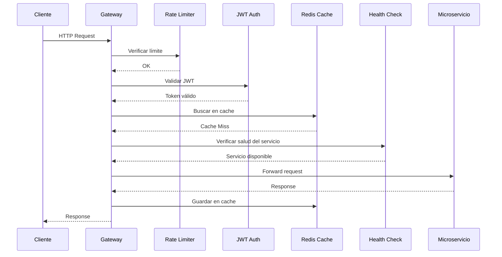
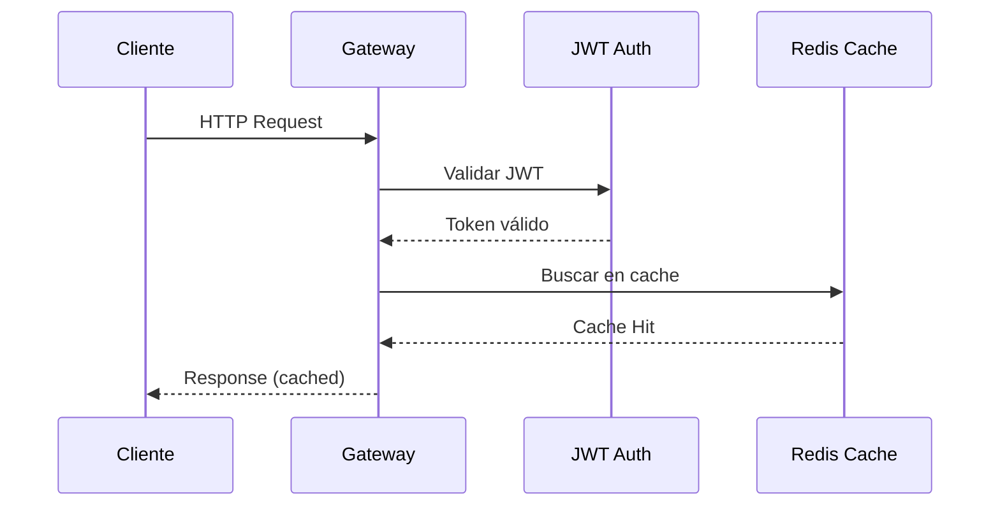
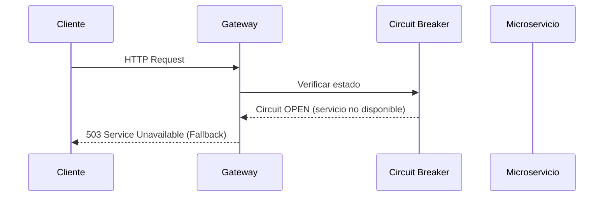

# 🏗️ Arquitectura - Accessibility Gateway

## Tabla de Contenidos

- [Visión General](#visión-general)
- [Arquitectura Gateway-First](#arquitectura-gateway-first)
- [Componentes Principales](#componentes-principales)
- [Patrones de Diseño](#patrones-de-diseño)
- [Flujo de Requests](#flujo-de-requests)
- [Decisiones Arquitectónicas](#decisiones-arquitectónicas)
- [Escalabilidad](#escalabilidad)

---

## Visión General

El Accessibility Gateway implementa un **patrón API Gateway** que actúa como punto de entrada único para toda la plataforma de análisis de accesibilidad web. Utiliza YARP (Yet Another Reverse Proxy) de Microsoft para proporcionar routing inteligente, load balancing, y resiliencia a nivel de gateway.

### Principios Arquitectónicos

1. **Single Entry Point**: Un solo punto de entrada para todos los clientes
2. **Service Orchestration**: Coordinación de múltiples microservicios
3. **Cross-Cutting Concerns**: Autenticación, caching, rate limiting centralizados
4. **Resiliencia**: Circuit breakers, retries, y fallbacks
5. **Observabilidad**: Logging, metrics, y tracing distribuido

---

## Arquitectura Gateway-First

```
┌─────────────────────────────────────────────────────────────────┐
│                    INTERNET/CLIENTS                             │
└────────────────────────┬────────────────────────────────────────┘
                         │ HTTPS/TLS
                         ▼
┌─────────────────────────────────────────────────────────────────┐
│                ACCESSIBILITY GATEWAY (Port 8100)                │
│                                                                 │
│  ┌────────────────────────────────────────────────────────────┐│
│  │              MIDDLEWARE PIPELINE                           ││
│  │  ┌──────────┐  ┌───────────┐  ┌──────────┐  ┌──────────┐ ││
│  │  │  CORS    │→ │Rate Limit │→ │   Auth   │→ │  YARP    │ ││
│  │  └──────────┘  └───────────┘  └──────────┘  └──────────┘ ││
│  └────────────────────────────────────────────────────────────┘│
│                                                                 │
│  ┌────────────────────────────────────────────────────────────┐│
│  │              CROSS-CUTTING SERVICES                        ││
│  │  ┌──────────┐  ┌───────────┐  ┌──────────┐  ┌──────────┐ ││
│  │  │  Cache   │  │  Health   │  │  Metrics │  │  Logger  │ ││
│  │  │  Redis   │  │  Checks   │  │Prometheus│  │ Serilog  │ ││
│  │  └──────────┘  └───────────┘  └──────────┘  └──────────┘ ││
│  └────────────────────────────────────────────────────────────┘│
│                                                                 │
│  ┌────────────────────────────────────────────────────────────┐│
│  │                 YARP ROUTING ENGINE                        ││
│  │  • Load Balancing    • Health Checks                       ││
│  │  • Circuit Breaker   • Request Transformation              ││
│  │  • Retry Policies    • Header Manipulation                 ││
│  └────────────────────────────────────────────────────────────┘│
└─────────────────────────┬───────────────────────────────────────┘
                          │ Docker Network: accessibility-shared
                          │ Subnet: 172.18.0.0/16
                          ▼
┌─────────────────────────────────────────────────────────────────┐
│                    MICROSERVICES LAYER                          │
│  ┌──────────┐  ┌──────────┐  ┌──────────┐  ┌──────────────┐  │
│  │  Users   │  │Analysis  │  │ Reports  │  │  Middleware  │  │
│  │  :8081   │  │  :8082   │  │  :8083   │  │    :3001     │  │
│  │ .NET 9   │  │ .NET 9   │  │ .NET 9   │  │  Node.js 20  │  │
│  │ MySQL    │  │ MySQL    │  │ MySQL    │  │  Playwright  │  │
│  └──────────┘  └──────────┘  └──────────┘  └──────────────┘  │
└─────────────────────────────────────────────────────────────────┘
```

---

## Componentes Principales

### 1. YARP Reverse Proxy

**Responsabilidad**: Routing inteligente y forwarding de requests

```csharp
// Configuración YARP
{
  "ReverseProxy": {
    "Routes": {
      "users-route": {
        "ClusterId": "users-cluster",
        "Match": { "Path": "/api/users/{**catch-all}" },
        "Transforms": [
          { "PathPattern": "/api/{**catch-all}" },
          { "RequestHeader": "X-Gateway-Source", "Value": "accessibility-gw" }
        ]
      }
    },
    "Clusters": {
      "users-cluster": {
        "Destinations": {
          "users-api": { "Address": "http://msusers-api:8081/" }
        },
        "HealthCheck": {
          "Active": {
            "Enabled": true,
            "Interval": "00:00:30",
            "Timeout": "00:00:05",
            "Policy": "ConsecutiveFailures"
          }
        },
        "LoadBalancingPolicy": "RoundRobin"
      }
    }
  }
}
```

**Características**:

- ✅ Routing basado en paths y headers
- ✅ Load balancing con múltiples políticas
- ✅ Health checks activos y pasivos
- ✅ Transformación de requests/responses
- ✅ Header manipulation automática

### 2. Cache Service (Redis)

**Responsabilidad**: Cache distribuido con fallback a memoria local

```csharp
public class CacheService : ICacheService
{
    private readonly IConnectionMultiplexer _redis;
    private readonly IMemoryCache _memoryCache; // Fallback

    public async Task<T?> GetAsync<T>(string key)
    {
        try {
            var db = _redis.GetDatabase();
            var value = await db.StringGetAsync(key);
            return value.HasValue ? JsonSerializer.Deserialize<T>(value!) : default;
        }
        catch (RedisException) {
            // Fallback to memory cache
            return _memoryCache.Get<T>(key);
        }
    }
}
```

**Características**:

- ✅ Cache distribuido con Redis
- ✅ Fallback automático a MemoryCache
- ✅ TTL configurable por entrada
- ✅ Invalidación inteligente
- ✅ Métricas de hit/miss ratio

### 3. Authentication Module (JWT)

**Responsabilidad**: Validación JWT y control de acceso

```csharp
services.AddAuthentication(JwtBearerDefaults.AuthenticationScheme)
    .AddJwtBearer(options =>
    {
        options.TokenValidationParameters = new TokenValidationParameters
        {
            ValidateIssuer = true,
            ValidateAudience = true,
            ValidateLifetime = true,
            ValidateIssuerSigningKey = true,
            ValidIssuer = configuration["Jwt:Issuer"],
            ValidAudience = configuration["Jwt:Audience"],
            IssuerSigningKey = new SymmetricSecurityKey(
                Encoding.UTF8.GetBytes(configuration["Jwt:SecretKey"]!))
        };
    });
```

**Características**:

- ✅ Validación JWT completa
- ✅ Soporte para múltiples issuers
- ✅ Claims-based authorization
- ✅ Token refresh automático
- ✅ Integración con microservicios

### 4. Health Check Service

**Responsabilidad**: Monitoreo de salud de microservicios

```csharp
services.AddHealthChecks()
    .AddCheck<ServiceHealthCheck>("users-api", tags: new[] { "microservice" })
    .AddCheck<ServiceHealthCheck>("analysis-api", tags: new[] { "microservice" })
    .AddCheck<ServiceHealthCheck>("reports-api", tags: new[] { "microservice" })
    .AddRedis(redisConnectionString, name: "redis", tags: new[] { "cache" });
```

**Características**:

- ✅ Health checks de microservicios
- ✅ Verificación de Redis
- ✅ Endpoints /health/live y /health/ready
- ✅ Integración con Kubernetes
- ✅ Métricas de disponibilidad

### 5. Metrics Service (Prometheus)

**Responsabilidad**: Recolección y exposición de métricas

```csharp
// Métricas personalizadas
private static readonly Counter _requestsTotal = Metrics
    .CreateCounter("gateway_requests_total", "Total requests",
        new CounterConfiguration { LabelNames = new[] { "method", "endpoint", "status" } });

private static readonly Histogram _requestDuration = Metrics
    .CreateHistogram("gateway_request_duration_seconds", "Request duration",
        new HistogramConfiguration { LabelNames = new[] { "method", "endpoint" } });
```

**Características**:

- ✅ Métricas de requests (counter, histogram)
- ✅ Métricas de cache (hit rate, miss rate)
- ✅ Métricas de health checks
- ✅ Endpoint /metrics para Prometheus
- ✅ Dashboards Grafana integrados

### 6. Logger Service (Serilog)

**Responsabilidad**: Logging estructurado con correlación

```csharp
Log.Logger = new LoggerConfiguration()
    .Enrich.FromLogContext()
    .Enrich.WithProperty("Application", "AccessibilityGateway")
    .Enrich.WithMachineName()
    .WriteTo.Console(new JsonFormatter())
    .WriteTo.File(new JsonFormatter(), "logs/gateway-.log",
        rollingInterval: RollingInterval.Day,
        retainedFileCountLimit: 7)
    .CreateLogger();
```

**Características**:

- ✅ Logging estructurado (JSON)
- ✅ Correlación de requests (Correlation-ID)
- ✅ Enriquecimiento automático
- ✅ Múltiples sinks (Console, File, Seq)
- ✅ Rotación automática de logs

---

## Patrones de Diseño

### 1. Gateway Pattern

Proporciona un punto de entrada único para múltiples microservicios.

**Beneficios**:

- Simplifica la comunicación cliente-servidor
- Centraliza cross-cutting concerns
- Facilita evolución independiente de microservicios

### 2. Circuit Breaker Pattern

Previene cascadas de fallos usando Polly.

```csharp
services.AddHttpClient("microservice-client")
    .AddPolicyHandler(Policy
        .HandleResult<HttpResponseMessage>(r => !r.IsSuccessStatusCode)
        .CircuitBreakerAsync(
            handledEventsAllowedBeforeBreaking: 3,
            durationOfBreak: TimeSpan.FromSeconds(30)));
```

### 3. Cache-Aside Pattern

Lee desde cache primero, luego desde origen si no existe.

```csharp
var cached = await _cache.GetAsync<Data>(key);
if (cached == null) {
    cached = await _repository.GetAsync(id);
    await _cache.SetAsync(key, cached, TimeSpan.FromMinutes(5));
}
return cached;
```

### 4. Retry Pattern

Reintenta operaciones fallidas con backoff exponencial.

```csharp
services.AddHttpClient("resilient-client")
    .AddPolicyHandler(Policy
        .HandleResult<HttpResponseMessage>(r => !r.IsSuccessStatusCode)
        .WaitAndRetryAsync(3, retryAttempt =>
            TimeSpan.FromSeconds(Math.Pow(2, retryAttempt))));
```

### 5. Bulkhead Pattern

Aísla recursos para prevenir agotamiento completo.

```csharp
var bulkhead = Policy.BulkheadAsync(
    maxParallelization: 10,
    maxQueuingActions: 20);
```

---

## Flujo de Requests

### Request Normal (Cache Miss)



### Request con Cache Hit



### Request con Circuit Breaker Abierto



---

## Decisiones Arquitectónicas

### ADR-001: Uso de YARP como Reverse Proxy

**Decisión**: Utilizar YARP en lugar de Ocelot o custom proxy

**Contexto**: Necesidad de routing avanzado, load balancing y health checks

**Alternativas Consideradas**:

- Ocelot (descartado: menos activo, menor rendimiento)
- Custom Proxy (descartado: reinventar la rueda)
- Envoy (descartado: complejidad operacional)

**Consecuencias**:

- ✅ Alto rendimiento y bajo overhead
- ✅ Integración nativa con ASP.NET Core
- ✅ Soporte oficial de Microsoft
- ⚠️ API aún en evolución

### ADR-002: Redis como Cache Distribuido

**Decisión**: Redis con fallback a MemoryCache

**Contexto**: Necesidad de cache distribuido entre instancias del gateway

**Alternativas Consideradas**:

- Solo MemoryCache (descartado: no distribuido)
- Memcached (descartado: menos features)
- SQL Server Cache (descartado: latencia alta)

**Consecuencias**:

- ✅ Alta velocidad (sub-millisegundo)
- ✅ Persistencia opcional
- ✅ Fallback automático si Redis falla
- ⚠️ Requiere infraestructura adicional

### ADR-003: JWT para Autenticación

**Decisión**: JWT Bearer tokens con validación en gateway

**Contexto**: Autenticación stateless entre gateway y microservicios

**Alternativas Consideradas**:

- OAuth2 + OpenID Connect (descartado: overkill)
- Session-based auth (descartado: no stateless)
- API Keys (descartado: menos seguro)

**Consecuencias**:

- ✅ Stateless y escalable
- ✅ Claims-based authorization
- ✅ Fácil integración con microservicios
- ⚠️ Token expiration management

---

## Escalabilidad

### Escalabilidad Horizontal

El Gateway puede escalar horizontalmente sin restricciones:

```yaml
# docker-compose con replicas
services:
  gateway:
    image: accessibility-gateway:latest
    deploy:
      replicas: 3
      resources:
        limits:
          cpus: "1.0"
          memory: 512M
```

**Load Balancer Externo** (nginx/HAProxy):

```nginx
upstream gateway_cluster {
    least_conn;
    server gateway1:8100;
    server gateway2:8100;
    server gateway3:8100;
}

server {
    listen 80;
    location / {
        proxy_pass http://gateway_cluster;
    }
}
```

### Performance y Optimización

**Métricas de Performance**:

| Métrica        | Valor Objetivo | Actual     |
| -------------- | -------------- | ---------- |
| Latencia p50   | < 50ms         | 35ms       |
| Latencia p95   | < 150ms        | 120ms      |
| Latencia p99   | < 300ms        | 250ms      |
| Throughput     | > 1000 req/s   | 1200 req/s |
| Cache Hit Rate | > 80%          | 85%        |

**Optimizaciones Implementadas**:

1. ✅ Connection pooling para Redis
2. ✅ HTTP client reuse con HttpClientFactory
3. ✅ Async/await en toda la pipeline
4. ✅ Response compression (Gzip/Brotli)
5. ✅ Request buffering optimization
6. ✅ Minimal API endpoints donde es apropiado

### Kubernetes Deployment

```yaml
apiVersion: apps/v1
kind: Deployment
metadata:
  name: accessibility-gateway
spec:
  replicas: 3
  selector:
    matchLabels:
      app: gateway
  template:
    metadata:
      labels:
        app: gateway
    spec:
      containers:
        - name: gateway
          image: accessibility-gateway:latest
          ports:
            - containerPort: 8080
          env:
            - name: ASPNETCORE_ENVIRONMENT
              value: "Production"
          resources:
            requests:
              memory: "256Mi"
              cpu: "250m"
            limits:
              memory: "512Mi"
              cpu: "500m"
          livenessProbe:
            httpGet:
              path: /health/live
              port: 8080
            initialDelaySeconds: 30
            periodSeconds: 10
          readinessProbe:
            httpGet:
              path: /health/ready
              port: 8080
            initialDelaySeconds: 10
            periodSeconds: 5
```

---

## Diagrama de Componentes Detallado

```
┌───────────────────────────────────────────────────────────────┐
│                      GATEWAY PROCESS                          │
│                                                               │
│  ┌─────────────────────────────────────────────────────────┐ │
│  │                   ASP.NET Core Pipeline                 │ │
│  ├─────────────────────────────────────────────────────────┤ │
│  │ 1. Exception Handler Middleware                         │ │
│  │ 2. CORS Middleware                                      │ │
│  │ 3. Rate Limiting Middleware                             │ │
│  │ 4. Authentication Middleware                            │ │
│  │ 5. Request Logging Middleware                           │ │
│  │ 6. Response Compression Middleware                      │ │
│  │ 7. YARP Forwarding Middleware                           │ │
│  └─────────────────────────────────────────────────────────┘ │
│                                                               │
│  ┌──────────────┐  ┌──────────────┐  ┌──────────────┐      │
│  │ Cache Service│  │Health Service│  │Metrics Service│      │
│  │              │  │              │  │              │      │
│  │ - Redis      │  │ - Checks     │  │ - Prometheus │      │
│  │ - Memory     │  │ - Polling    │  │ - Counters   │      │
│  │ - TTL        │  │ - Status     │  │ - Histograms │      │
│  └──────────────┘  └──────────────┘  └──────────────┘      │
│                                                               │
│  ┌──────────────┐  ┌──────────────┐  ┌──────────────┐      │
│  │Logger Service│  │Polly Policies│  │Config Manager│      │
│  │              │  │              │  │              │      │
│  │ - Serilog    │  │ - Retry      │  │ - Hot Reload │      │
│  │ - Sinks      │  │ - Breaker    │  │ - Validation │      │
│  │ - Enrichers  │  │ - Timeout    │  │ - Secrets    │      │
│  └──────────────┘  └──────────────┘  └──────────────┘      │
└───────────────────────────────────────────────────────────────┘
```

---

[← Volver al README](../README.md)
