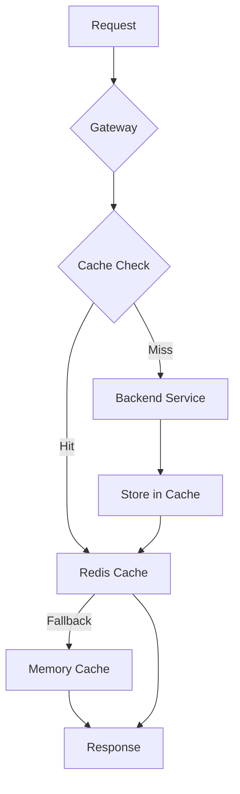

# 💾 Sistema de Caché

> Documentación completa del sistema de caché distribuido con Redis y fallback a memoria.

## 📋 Tabla de Contenidos

- [Arquitectura del Caché](#arquitectura-del-caché)
- [Configuración](#configuración)
- [Estrategias de Caché](#estrategias-de-caché)
- [Invalidación](#invalidación)
- [Monitoreo](#monitoreo)
- [Troubleshooting](#troubleshooting)

---

## 🏗️ Arquitectura del Caché

### Modelo de Caché Híbrido



### Niveles de Caché

| Nivel  | Tecnología   | TTL por defecto | Uso                    |
| ------ | ------------ | --------------- | ---------------------- |
| **L1** | Memory Cache | 5 minutos       | Fallback y desarrollo  |
| **L2** | Redis        | 30 minutos      | Producción distribuido |

---

## ⚙️ Configuración

### Variables de Entorno

```env
# Redis Connection
REDIS_CONNECTION_STRING=localhost:6379
REDIS_DATABASE=0
REDIS_INSTANCE_NAME=AccessibilityGateway:

# Cache Configuration
CACHE_DEFAULT_TTL_MINUTES=30
CACHE_ENABLED=true
CACHE_FALLBACK_TO_MEMORY=true

# Redis Options
REDIS_CONNECT_TIMEOUT=5000
REDIS_SYNC_TIMEOUT=5000
REDIS_CONNECT_RETRY=3
REDIS_ABORT_ON_CONNECT_FAIL=false
```

### Configuración en Program.cs

```csharp
// Configuración de Redis
builder.Services.AddStackExchangeRedisCache(options =>
{
    var redisConnection = builder.Configuration["Redis:ConnectionString"];

    if (!string.IsNullOrEmpty(redisConnection))
    {
        options.Configuration = redisConnection;
        options.InstanceName = builder.Configuration["Redis:InstanceName"]
            ?? "AccessibilityGateway:";

        options.ConfigurationOptions = new ConfigurationOptions
        {
            EndPoints = { redisConnection },
            ConnectTimeout = 5000,
            SyncTimeout = 5000,
            AbortOnConnectFail = false,
            ConnectRetry = 3,
            KeepAlive = 60,
            DefaultDatabase = 0
        };
    }
});

// Fallback a memoria
builder.Services.AddMemoryCache(options =>
{
    options.SizeLimit = 100 * 1024 * 1024; // 100MB
    options.CompactionPercentage = 0.20;
});

// Registrar servicio de caché
builder.Services.AddSingleton<ICacheService, CacheService>();
```

---

## 🎯 Estrategias de Caché

### CacheService - Implementación

```csharp
public class CacheService : ICacheService
{
    private readonly IDistributedCache _distributedCache;
    private readonly IMemoryCache _memoryCache;
    private readonly ILogger<CacheService> _logger;
    private readonly bool _useRedis;

    public CacheService(
        IDistributedCache distributedCache,
        IMemoryCache memoryCache,
        ILogger<CacheService> logger,
        IConfiguration configuration)
    {
        _distributedCache = distributedCache;
        _memoryCache = memoryCache;
        _logger = logger;

        // Determinar si Redis está disponible
        _useRedis = !string.IsNullOrEmpty(
            configuration["Redis:ConnectionString"]);
    }

    public async Task<T?> GetAsync<T>(string key, CancellationToken ct = default)
    {
        try
        {
            if (_useRedis)
            {
                var cachedData = await _distributedCache.GetStringAsync(key, ct);
                if (!string.IsNullOrEmpty(cachedData))
                {
                    _logger.LogDebug("Cache hit for key: {Key} (Redis)", key);
                    return JsonSerializer.Deserialize<T>(cachedData);
                }
            }

            // Fallback a memoria
            if (_memoryCache.TryGetValue(key, out T? value))
            {
                _logger.LogDebug("Cache hit for key: {Key} (Memory)", key);
                return value;
            }

            _logger.LogDebug("Cache miss for key: {Key}", key);
            return default;
        }
        catch (Exception ex)
        {
            _logger.LogError(ex, "Error getting cache for key: {Key}", key);
            return default;
        }
    }

    public async Task SetAsync<T>(
        string key,
        T value,
        TimeSpan? expiration = null,
        CancellationToken ct = default)
    {
        var options = new DistributedCacheEntryOptions
        {
            AbsoluteExpirationRelativeToNow = expiration ?? TimeSpan.FromMinutes(30)
        };

        try
        {
            if (_useRedis)
            {
                var serializedData = JsonSerializer.Serialize(value);
                await _distributedCache.SetStringAsync(key, serializedData, options, ct);
                _logger.LogDebug("Cache set for key: {Key} (Redis)", key);
            }

            // Guardar también en memoria
            var memoryOptions = new MemoryCacheEntryOptions
            {
                AbsoluteExpirationRelativeToNow = expiration ?? TimeSpan.FromMinutes(5),
                Size = 1
            };
            _memoryCache.Set(key, value, memoryOptions);
            _logger.LogDebug("Cache set for key: {Key} (Memory)", key);
        }
        catch (Exception ex)
        {
            _logger.LogError(ex, "Error setting cache for key: {Key}", key);
        }
    }

    public async Task RemoveAsync(string key, CancellationToken ct = default)
    {
        try
        {
            if (_useRedis)
            {
                await _distributedCache.RemoveAsync(key, ct);
            }
            _memoryCache.Remove(key);
            _logger.LogInformation("Cache removed for key: {Key}", key);
        }
        catch (Exception ex)
        {
            _logger.LogError(ex, "Error removing cache for key: {Key}", key);
        }
    }

    public async Task<T> GetOrSetAsync<T>(
        string key,
        Func<Task<T>> factory,
        TimeSpan? expiration = null,
        CancellationToken ct = default)
    {
        // Intentar obtener del caché
        var cachedValue = await GetAsync<T>(key, ct);
        if (cachedValue != null)
        {
            return cachedValue;
        }

        // Generar nuevo valor
        var value = await factory();

        // Guardar en caché
        await SetAsync(key, value, expiration, ct);

        return value;
    }
}
```

### Uso en Endpoints

```csharp
// Ejemplo: Cachear respuesta de endpoint
app.MapGet("/api/users/{id}", async (
    int id,
    ICacheService cache,
    IUserService userService) =>
{
    var cacheKey = $"user:{id}";

    var user = await cache.GetOrSetAsync(
        cacheKey,
        async () => await userService.GetUserByIdAsync(id),
        TimeSpan.FromMinutes(15)
    );

    return user is not null ? Results.Ok(user) : Results.NotFound();
});
```

### Patrones de Clave

```csharp
public static class CacheKeys
{
    // Prefijos por entidad
    public const string UserPrefix = "user";
    public const string AnalysisPrefix = "analysis";
    public const string ReportPrefix = "report";

    // Generadores de claves
    public static string User(int id) => $"{UserPrefix}:{id}";
    public static string UserProfile(int id) => $"{UserPrefix}:profile:{id}";
    public static string Analysis(int id) => $"{AnalysisPrefix}:{id}";
    public static string AnalysisList(int userId) => $"{AnalysisPrefix}:list:{userId}";
    public static string Report(int id) => $"{ReportPrefix}:{id}";

    // Patrones para invalidación
    public static string UserPattern(int id) => $"{UserPrefix}:{id}*";
    public static string AllUsers() => $"{UserPrefix}:*";
}
```

---

## 🔄 Invalidación

### Estrategias de Invalidación

#### 1. Invalidación Individual

```csharp
// Invalidar caché específico
await _cacheService.RemoveAsync(CacheKeys.User(userId));
```

#### 2. Invalidación por Patrón

```csharp
public async Task RemoveByPatternAsync(string pattern, CancellationToken ct = default)
{
    try
    {
        if (_useRedis)
        {
            var redis = _connectionMultiplexer.GetDatabase();
            var server = _connectionMultiplexer.GetServer(
                _connectionMultiplexer.GetEndPoints().First());

            var keys = server.Keys(pattern: pattern);
            foreach (var key in keys)
            {
                await redis.KeyDeleteAsync(key);
            }
            _logger.LogInformation("Cache invalidated for pattern: {Pattern}", pattern);
        }

        // Para memoria: limpiar todo (no soporta patterns)
        if (_memoryCache is MemoryCache memCache)
        {
            memCache.Compact(1.0);
        }
    }
    catch (Exception ex)
    {
        _logger.LogError(ex, "Error invalidating cache by pattern: {Pattern}", pattern);
    }
}
```

#### 3. Invalidación Automática en Escritura

```csharp
// Middleware de invalidación automática
public class CacheInvalidationMiddleware
{
    private readonly RequestDelegate _next;
    private readonly ICacheService _cache;

    public CacheInvalidationMiddleware(RequestDelegate next, ICacheService cache)
    {
        _next = next;
        _cache = cache;
    }

    public async Task InvokeAsync(HttpContext context)
    {
        // Guardar método original
        var method = context.Request.Method;
        var path = context.Request.Path.Value;

        // Ejecutar request
        await _next(context);

        // Invalidar en métodos de escritura
        if (context.Response.StatusCode >= 200 && context.Response.StatusCode < 300)
        {
            if (method == "POST" || method == "PUT" || method == "DELETE")
            {
                await InvalidateCacheForPath(path);
            }
        }
    }

    private async Task InvalidateCacheForPath(string path)
    {
        // Extraer entidad del path
        if (path.Contains("/users"))
        {
            await _cache.RemoveByPatternAsync(CacheKeys.AllUsers());
        }
        else if (path.Contains("/analysis"))
        {
            await _cache.RemoveByPatternAsync($"{CacheKeys.AnalysisPrefix}:*");
        }
        // ... más entidades
    }
}
```

#### 4. TTL Inteligente

```csharp
public static class CacheTTL
{
    // TTLs por tipo de dato
    public static TimeSpan ShortTerm = TimeSpan.FromMinutes(5);   // Datos volátiles
    public static TimeSpan MediumTerm = TimeSpan.FromMinutes(30); // Datos normales
    public static TimeSpan LongTerm = TimeSpan.FromHours(2);      // Datos estables

    // TTL según hora del día
    public static TimeSpan GetDynamicTTL()
    {
        var hour = DateTime.Now.Hour;

        // Durante horas pico (9-18), TTL más corto
        if (hour >= 9 && hour <= 18)
            return TimeSpan.FromMinutes(15);

        // Fuera de horas pico, TTL más largo
        return TimeSpan.FromHours(1);
    }
}
```

---

## 📊 Monitoreo

### Métricas de Caché

```csharp
public class CacheMetrics
{
    private long _hits;
    private long _misses;
    private long _errors;

    public void RecordHit() => Interlocked.Increment(ref _hits);
    public void RecordMiss() => Interlocked.Increment(ref _misses);
    public void RecordError() => Interlocked.Increment(ref _errors);

    public double GetHitRatio()
    {
        var total = _hits + _misses;
        return total > 0 ? (double)_hits / total * 100 : 0;
    }

    public CacheStats GetStats() => new()
    {
        Hits = _hits,
        Misses = _misses,
        Errors = _errors,
        HitRatio = GetHitRatio(),
        Total = _hits + _misses
    };
}

public record CacheStats
{
    public long Hits { get; init; }
    public long Misses { get; init; }
    public long Errors { get; init; }
    public double HitRatio { get; init; }
    public long Total { get; init; }
}
```

### Endpoint de Estadísticas

```csharp
app.MapGet("/api/cache/stats", async (ICacheService cache, CacheMetrics metrics) =>
{
    var stats = metrics.GetStats();

    return Results.Ok(new
    {
        cache = new
        {
            hits = stats.Hits,
            misses = stats.Misses,
            errors = stats.Errors,
            hitRatio = $"{stats.HitRatio:F2}%",
            total = stats.Total
        },
        redis = new
        {
            connected = await cache.IsRedisAvailableAsync(),
            database = 0
        }
    });
})
.RequireAuthorization("AdminOnly");
```

### Logs de Caché

```csharp
// En CacheService
private void LogCacheOperation(string operation, string key, bool success)
{
    if (success)
    {
        _logger.LogDebug(
            "Cache {Operation} successful for key: {Key}",
            operation, key);
    }
    else
    {
        _logger.LogWarning(
            "Cache {Operation} failed for key: {Key}",
            operation, key);
    }
}
```

---

## 🔧 Troubleshooting

### Problemas Comunes

#### Redis no conecta

```bash
# Verificar Redis
docker logs redis

# Probar conexión
redis-cli -h localhost -p 6379 ping
# Esperado: PONG

# Verificar variables
echo $REDIS_CONNECTION_STRING
```

**Solución**: El sistema automáticamente usa memoria como fallback.

#### Hit Ratio Bajo

```bash
# Ver estadísticas
curl http://localhost:8100/api/cache/stats

# Verificar TTL
# Si hit ratio < 50%, considerar:
# - Aumentar TTL
# - Revisar patrones de invalidación
# - Verificar que las claves sean consistentes
```

#### Memoria Cache Crece Mucho

```csharp
// Configurar límite de memoria
builder.Services.AddMemoryCache(options =>
{
    options.SizeLimit = 100 * 1024 * 1024; // 100MB
    options.CompactionPercentage = 0.20;   // Compactar 20% cuando se alcance límite
    options.ExpirationScanFrequency = TimeSpan.FromMinutes(1);
});
```

#### Redis Lento

```bash
# Verificar latencia
redis-cli --latency

# Ver uso de memoria
redis-cli INFO memory

# Limpiar claves expiradas
redis-cli FLUSHDB
```

### Comandos Redis Útiles

```bash
# Ver todas las claves
redis-cli KEYS "AccessibilityGateway:*"

# Ver valor de una clave
redis-cli GET "AccessibilityGateway:user:123"

# Ver TTL de una clave
redis-cli TTL "AccessibilityGateway:user:123"

# Eliminar clave
redis-cli DEL "AccessibilityGateway:user:123"

# Limpiar todas las claves con patrón
redis-cli --scan --pattern "AccessibilityGateway:user:*" | xargs redis-cli DEL

# Ver estadísticas
redis-cli INFO stats
```

### Health Check de Redis

```csharp
public class RedisHealthCheck : IHealthCheck
{
    private readonly IConnectionMultiplexer _redis;

    public RedisHealthCheck(IConnectionMultiplexer redis)
    {
        _redis = redis;
    }

    public async Task<HealthCheckResult> CheckHealthAsync(
        HealthCheckContext context,
        CancellationToken cancellationToken = default)
    {
        try
        {
            var db = _redis.GetDatabase();
            await db.PingAsync();

            return HealthCheckResult.Healthy("Redis is available");
        }
        catch (Exception ex)
        {
            return HealthCheckResult.Unhealthy(
                "Redis is unavailable",
                exception: ex);
        }
    }
}

// Registrar
builder.Services.AddHealthChecks()
    .AddCheck<RedisHealthCheck>("redis");
```

---

## 📈 Optimizaciones

### 1. Compresión de Datos

```csharp
public async Task SetCompressedAsync<T>(
    string key,
    T value,
    TimeSpan? expiration = null)
{
    var json = JsonSerializer.Serialize(value);
    var bytes = Encoding.UTF8.GetBytes(json);

    using var output = new MemoryStream();
    using (var gzip = new GZipStream(output, CompressionMode.Compress))
    {
        await gzip.WriteAsync(bytes);
    }

    var compressed = output.ToArray();
    await _distributedCache.SetAsync(key, compressed, new DistributedCacheEntryOptions
    {
        AbsoluteExpirationRelativeToNow = expiration
    });
}
```

### 2. Batch Operations

```csharp
public async Task SetManyAsync<T>(
    Dictionary<string, T> items,
    TimeSpan? expiration = null)
{
    var tasks = items.Select(kvp =>
        SetAsync(kvp.Key, kvp.Value, expiration));

    await Task.WhenAll(tasks);
}
```

### 3. Cache Warming

```csharp
public class CacheWarmingService : BackgroundService
{
    private readonly ICacheService _cache;
    private readonly IServiceProvider _services;

    protected override async Task ExecuteAsync(CancellationToken stoppingToken)
    {
        while (!stoppingToken.IsCancellationRequested)
        {
            await WarmUpCache();
            await Task.Delay(TimeSpan.FromHours(1), stoppingToken);
        }
    }

    private async Task WarmUpCache()
    {
        using var scope = _services.CreateScope();
        var userService = scope.ServiceProvider.GetRequiredService<IUserService>();

        // Cachear usuarios activos
        var activeUsers = await userService.GetActiveUsersAsync();
        foreach (var user in activeUsers)
        {
            await _cache.SetAsync(
                CacheKeys.User(user.Id),
                user,
                TimeSpan.FromHours(1)
            );
        }
    }
}
```

---

## 📚 Referencias

- [Redis Best Practices](https://redis.io/docs/manual/patterns/)
- [ASP.NET Core Caching](https://learn.microsoft.com/en-us/aspnet/core/performance/caching/)
- [StackExchange.Redis](https://stackexchange.github.io/StackExchange.Redis/)

---

[⬅️ Volver al README](../README.new.md)
