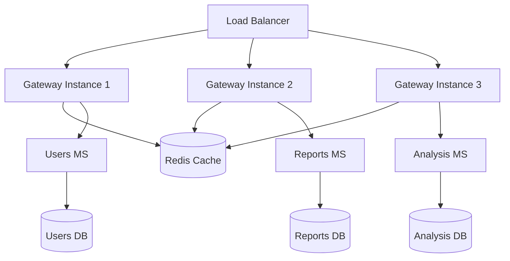

# Guía de Despliegue - Accessibility Gateway

Esta guía proporciona instrucciones detalladas para desplegar el Accessibility Gateway en diferentes entornos.

## 🏗️ Arquitectura de Despliegue



## 🐳 Despliegue con Docker

### Desarrollo Local

```bash
# Clonar repositorio
git clone <repo-url>
cd accessibility-gw

# Configurar variables de entorno
cp .env.example .env
# Editar .env con sus valores

# Iniciar servicios de desarrollo
docker-compose -f docker-compose.dev.yml up -d

# Verificar servicios
docker-compose ps
curl http://localhost:8080/health
```

### Producción con Docker Compose

```bash
# Build de imagen de producción
./docker-build.ps1 prod

# Iniciar servicios de producción
docker-compose up -d

# Verificar despliegue
curl http://localhost:8000/health
curl http://localhost:8000/info
```

## ☸️ Despliegue en Kubernetes

### Manifiestos Kubernetes

**Deployment**

```yaml
apiVersion: apps/v1
kind: Deployment
metadata:
  name: accessibility-gateway
  labels:
    app: accessibility-gateway
spec:
  replicas: 3
  selector:
    matchLabels:
      app: accessibility-gateway
  template:
    metadata:
      labels:
        app: accessibility-gateway
    spec:
      containers:
        - name: gateway
          image: accessibility-gateway:latest
          ports:
            - containerPort: 8080
          env:
            - name: ASPNETCORE_ENVIRONMENT
              value: 'Production'
            - name: Gate__Services__users
              value: 'http://users-service:8080'
            - name: Redis__ConnectionString
              value: 'redis-service:6379'
          resources:
            limits:
              cpu: 500m
              memory: 256Mi
            requests:
              cpu: 250m
              memory: 128Mi
          livenessProbe:
            httpGet:
              path: /health/live
              port: 8080
            initialDelaySeconds: 30
            periodSeconds: 30
          readinessProbe:
            httpGet:
              path: /health/ready
              port: 8080
            initialDelaySeconds: 15
            periodSeconds: 15
```

**Service**

```yaml
apiVersion: v1
kind: Service
metadata:
  name: accessibility-gateway-service
spec:
  selector:
    app: accessibility-gateway
  ports:
    - protocol: TCP
      port: 80
      targetPort: 8080
  type: ClusterIP
```

**Ingress**

```yaml
apiVersion: networking.k8s.io/v1
kind: Ingress
metadata:
  name: accessibility-gateway-ingress
  annotations:
    kubernetes.io/ingress.class: nginx
    cert-manager.io/cluster-issuer: letsencrypt-prod
    nginx.ingress.kubernetes.io/rate-limit: '100'
spec:
  tls:
    - hosts:
        - api.accessibility.company.com
      secretName: gateway-tls
  rules:
    - host: api.accessibility.company.com
      http:
        paths:
          - path: /
            pathType: Prefix
            backend:
              service:
                name: accessibility-gateway-service
                port:
                  number: 80
```

### Comandos de Despliegue K8s

```bash
# Aplicar manifiestos
kubectl apply -f k8s/

# Verificar pods
kubectl get pods -l app=accessibility-gateway

# Ver logs
kubectl logs -l app=accessibility-gateway -f

# Escalar
kubectl scale deployment accessibility-gateway --replicas=5

# Ver estado del ingress
kubectl describe ingress accessibility-gateway-ingress
```

## 🌐 Despliegue en Azure

### Azure Container Instances

```bash
# Login a Azure
az login

# Crear resource group
az group create --name rg-accessibility --location eastus

# Deploy container
az container create \
  --resource-group rg-accessibility \
  --name accessibility-gateway \
  --image accessibility-gateway:latest \
  --dns-name-label accessibility-gw \
  --ports 8080 \
  --environment-variables \
    ASPNETCORE_ENVIRONMENT=Production \
    Gate__Services__users=https://users.company.com \
    Redis__ConnectionString="redis.company.com:6379"
```

### Azure Kubernetes Service (AKS)

```bash
# Crear cluster AKS
az aks create \
  --resource-group rg-accessibility \
  --name aks-accessibility \
  --node-count 3 \
  --generate-ssh-keys

# Obtener credenciales
az aks get-credentials --resource-group rg-accessibility --name aks-accessibility

# Deploy aplicación
kubectl apply -f k8s/

# Configurar ingress controller
kubectl apply -f https://raw.githubusercontent.com/kubernetes/ingress-nginx/controller-v1.8.2/deploy/static/provider/cloud/deploy.yaml
```

### Azure App Service

```bash
# Crear App Service Plan
az appservice plan create \
  --name plan-accessibility \
  --resource-group rg-accessibility \
  --sku B1 \
  --is-linux

# Crear Web App
az webapp create \
  --resource-group rg-accessibility \
  --plan plan-accessibility \
  --name accessibility-gateway-app \
  --deployment-container-image-name accessibility-gateway:latest

# Configurar variables de entorno
az webapp config appsettings set \
  --resource-group rg-accessibility \
  --name accessibility-gateway-app \
  --settings ASPNETCORE_ENVIRONMENT=Production
```

## 🚀 Despliegue en AWS

### Amazon ECS

```bash
# Crear cluster
aws ecs create-cluster --cluster-name accessibility-cluster

# Registrar task definition
aws ecs register-task-definition --cli-input-json file://task-definition.json

# Crear servicio
aws ecs create-service \
  --cluster accessibility-cluster \
  --service-name accessibility-gateway \
  --task-definition accessibility-gateway:1 \
  --desired-count 3
```

### Amazon EKS

```bash
# Crear cluster EKS
eksctl create cluster --name accessibility-cluster --region us-west-2

# Deploy aplicación
kubectl apply -f k8s/

# Configurar ALB Ingress Controller
eksctl utils associate-iam-oidc-provider --cluster accessibility-cluster --approve
```

## 🔧 Configuración por Entorno

### Variables de Entorno Críticas

```bash
# Obligatorias
ASPNETCORE_ENVIRONMENT=Production
Gate__Services__users=http://users-service:8080
Gate__Services__reports=http://reports-service:8081
Gate__Services__analysis=http://analysis-service:8082
Gate__Services__middleware=http://middleware-service:3000

# Autenticación
Jwt__Authority=https://identity.company.com
Jwt__Audience=accessibility-gateway

# Caché
Redis__ConnectionString=redis.company.com:6379

# Opcional pero recomendado
Gate__DefaultTimeoutSeconds=30
Gate__MaxPayloadSizeBytes=10485760
Gate__EnableCaching=true
```

### Configuración de Secretos

**Kubernetes Secrets**

```yaml
apiVersion: v1
kind: Secret
metadata:
  name: gateway-secrets
type: Opaque
data:
  jwt-signing-key: <base64-encoded-key>
  redis-password: <base64-encoded-password>
```

**Azure Key Vault**

```bash
# Crear Key Vault
az keyvault create \
  --name kv-accessibility \
  --resource-group rg-accessibility \
  --location eastus

# Agregar secretos
az keyvault secret set --vault-name kv-accessibility --name "JwtSigningKey" --value "your-key"
az keyvault secret set --vault-name kv-accessibility --name "RedisPassword" --value "your-password"
```

## 📊 Monitoreo Post-Despliegue

### Health Checks

```bash
# Verificar salud básica
curl https://api.company.com/health

# Verificación profunda
curl "https://api.company.com/health?deep=true&includeMetrics=true"

# Liveness y readiness
curl https://api.company.com/health/live
curl https://api.company.com/health/ready
```

### Métricas y Observabilidad

```bash
# Métricas del gateway
curl https://api.company.com/metrics

# Información del gateway
curl https://api.company.com/info

# Logs (dependiendo del entorno)
kubectl logs -l app=accessibility-gateway -f
docker-compose logs -f accessibility-gateway
az webapp log tail --resource-group rg-accessibility --name accessibility-gateway-app
```

## 🔄 Proceso de CI/CD

### Pipeline de Despliegue

1. **Build & Test**

   - Compilación de código
   - Ejecución de pruebas unitarias
   - Análisis de código estático

2. **Security Scan**

   - Escaneo de vulnerabilidades
   - Análisis de dependencias

3. **Docker Build**

   - Build de imagen Docker
   - Push a registry

4. **Deploy to Staging**

   - Despliegue automático a staging
   - Pruebas de integración

5. **Deploy to Production**
   - Aprobación manual
   - Despliegue blue-green
   - Smoke tests

### Configuración GitHub Actions

```yaml
# .github/workflows/deploy.yml
name: Deploy to Production

on:
  push:
    branches: [main]

jobs:
  deploy:
    runs-on: ubuntu-latest
    steps:
      - uses: actions/checkout@v4

      - name: Build and push
        uses: docker/build-push-action@v5
        with:
          push: true
          tags: ${{ env.REGISTRY }}/${{ env.IMAGE_NAME }}:${{ github.sha }}

      - name: Deploy to AKS
        run: |
          kubectl set image deployment/accessibility-gateway \
            gateway=${{ env.REGISTRY }}/${{ env.IMAGE_NAME }}:${{ github.sha }}
```

## 🚨 Troubleshooting

### Problemas Comunes

**Gateway no responde**

```bash
# Verificar logs
kubectl logs -l app=accessibility-gateway --tail=100

# Verificar recursos
kubectl describe pod <pod-name>
kubectl top pod <pod-name>
```

**Servicios no accesibles**

```bash
# Verificar conectividad de red
kubectl exec -it <gateway-pod> -- curl http://users-service:8080/health

# Verificar DNS
kubectl exec -it <gateway-pod> -- nslookup users-service
```

**Rate limiting excesivo**

```bash
# Verificar configuración
curl -I https://api.company.com/api/v1/translate

# Ajustar límites
kubectl set env deployment/accessibility-gateway RATE_LIMIT_GLOBAL=200
```

## 📈 Escalamiento y Performance

### Escalamiento Horizontal

```bash
# Kubernetes
kubectl scale deployment accessibility-gateway --replicas=10

# Docker Swarm
docker service scale accessibility-gateway=10
```

### Optimizaciones de Performance

1. **Configurar resource limits**
2. **Optimizar connection pooling**
3. **Configurar caché Redis cluster**
4. **Implementar CDN para recursos estáticos**
5. **Configurar compression**

### Métricas de Performance

```bash
# Latencia P50, P95, P99
curl https://api.company.com/metrics | grep response_time

# Throughput
curl https://api.company.com/metrics | grep requests_per_second

# Error rate
curl https://api.company.com/metrics | grep error_rate
```
